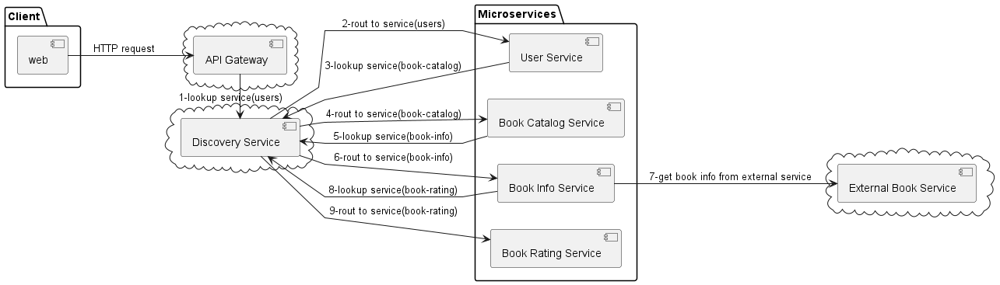

# What is this repository
This repo is a  REST API to manage a  users and books, in order to practice microservices
development and deployment using spring cloud and docker.

# Architecture



The project is divided into 7 microservices:
- user-service: Provides the user management API
- discovery-service: Eureka server to register and discover microservices
- gateway-service: API gateway to route requests to the correct microservice
- configuration-service: Configuration server to provide configuration to the microservices
- book-catalog-service: Provides the book catalog for users
- book-info-service: Provides the book information that is integrated with external book service [gutendex.com](https://gutendex.com/)
- book-rating-service: Provides the book ratings for a user

# Technologies used
- Java 17
- Spring Boot
- Spring Cloud
    - Eureka
    - Gateway
    - Config
    - circuit breaker
    - openfeign
    - bus
- Spring Cloud
- Spring Cloud Eureka
- Spring Cloud Gateway
- Docker
- Docker Compose
- H2 Database
- Swagger
- RabbitMQ


# How to run the project
To run the project you need to have docker and docker-compose installed in your machine.   
Then you can run the following to start the project.
```
docker-compose up
``` 
Also, you can run the project using you IDE, just run the main class of each microservice.
with the following order:
1. configuration-server
2. discovery-server
3. all other microservices
4. api-gateway

After the project is started you can access the API documentation at  
http://localhost:8082/swagger-ui/index.html

A postman collection is provided in the project to test the API.  
[Microservice-demo.postman_collection.json](Microservice-demo.postman_collection.json)

# Endpoints
The API is a REST API that provides the following endpoints:

- POST /users: Create a new user
- POST/users/login: Login a user
- GET /users/{id}: Get a user by id

# Configuration
- The project uses a configuration server to provide configuration to the microservices.
- The configuration is stored in local file and the configuration server reads the configuration from there.
- RabbitMQ is used to notify the microservices when the configuration is updated, so they can refresh their configuration.
  without the need to restart the microservices.

# Load Balancing
- The project uses the gateway to route the requests to the correct microservice.
- The gateway uses the Eureka server to discover the microservices.


# Circuit Breaker
- The project uses the circuit breaker pattern to prevent the system from failing when a service is down.
- The project uses the resilience4j library to implement the circuit breaker pattern.

# Security
- The project uses JWT to secure the API. To access the API you need to create a user using the /users endpoint and then login using the /users/login endpoint.
- The login endpoint will return a JWT token that you need to use to access the other endpoints.

# Monitoring
- The project uses actuator to provide monitoring endpoints.
- The project uses zipkin to trace the requests between the microservices.


# Future improvements
- Add routing for swagger documentation url in the gateway.
- RabbitMQ is started using docker-compose.
- Zipkin is started using docker-compose.
- Elk stack can be added to the project to provide log monitoring.
- The project uses H2 database to store the data, but it can be easily changed to use a real database like MySQL or PostgreSQL.
- The project uses a local file to store the configuration, but it can be easily changed to use a git repository to store the configuration.


